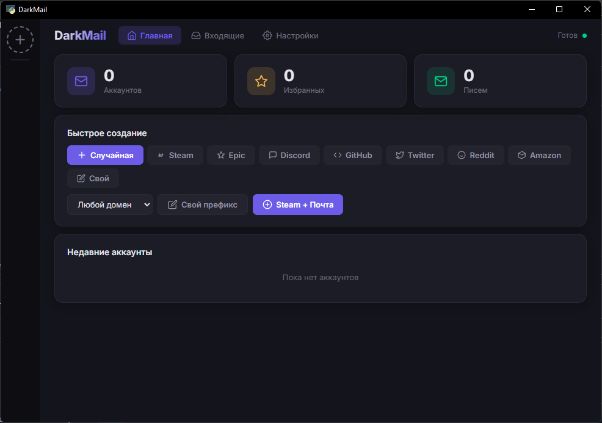
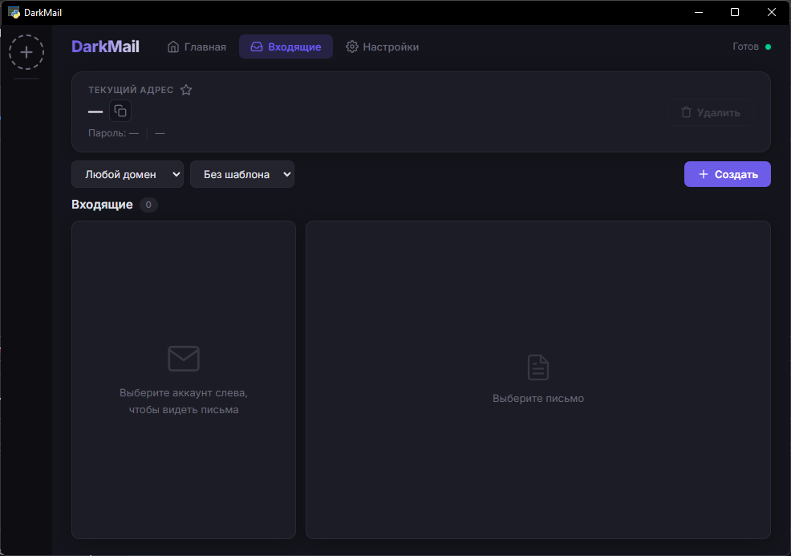
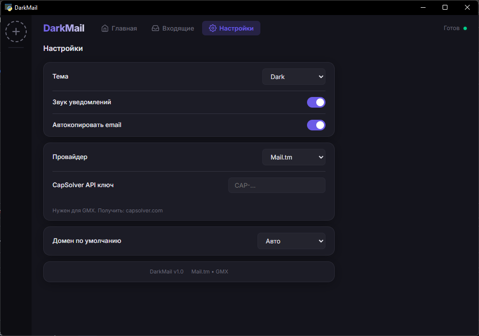
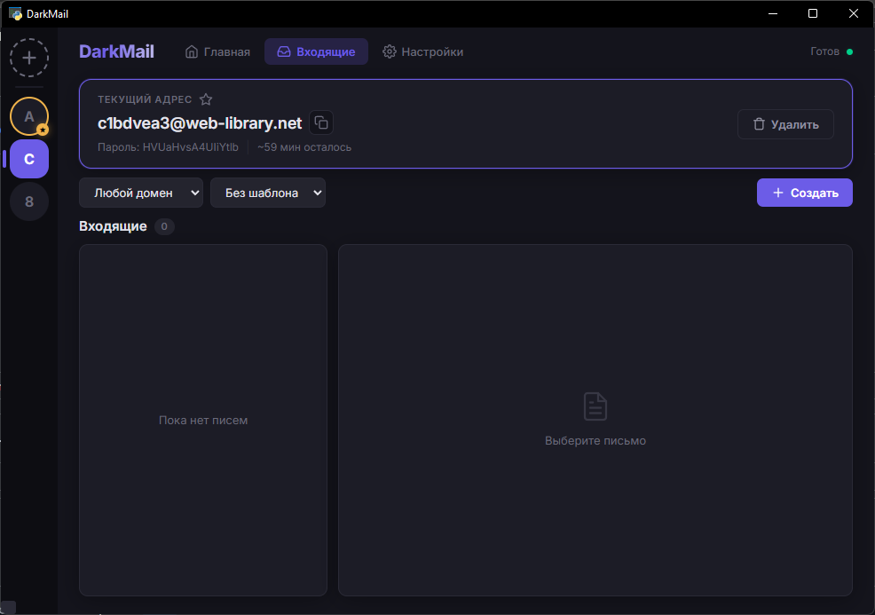

# DarkMail - вайб кодинг приложение

Десктопное приложение для временных email-адресов с поддержкой нескольких аккаунтов, тем оформления и гибкостью провайдеров.


## Возможности

- **Временные email** — создавайте одноразовые адреса в один клик
- **Несколько аккаунтов** — переключайтесь между активными почтовыми ящиками, помечайте избранные
- **Провайдеры** — Mail.tm (бесплатно, без капчи) и GMX.com (через CapSolver)
- **Шаблоны** — создание email в один клик для Steam, Epic, Discord, GitHub, Twitter, Reddit, Amazon
- **Письма** — чтение, удаление, экспорт (TXT/HTML), скачивание вложений
- **8 тем** — Dark, Light, CMD, Midnight, Cyber, Nord, Sunset, Mono
- **Звуковые уведомления** — звуковой сигнал при новом письме
- **Автокопирование** — новый email автоматически копируется в буфер обмена
- **Таймер жизни** — показывает оставшееся время для аккаунтов Mail.tm (1 час)
- **Свои модалки** — без нативных диалогов браузера, полностью стилизованный UI
- **Контекстное меню** — правый клик: копировать отправителя, удалить письмо
- **Сохранение настроек** — тема, провайдер, API ключи сохраняются в `settings.json`

## Требования

- Python 3.8 или выше
- Windows (используется pywebview — WebView2 runtime)

## Установка

```bash
# Клонирование репозитория
git clone https://github.com/2festty/DarkMail-vibecoder.git
cd darkmail

# Создание виртуального окружения (рекомендуется)
python -m venv venv
.\venv\Scripts\activate

# Установка зависимостей
pip install pywebview requests

# Опционально: для поддержки GMX
pip install curl_cffi
```

## Запуск

```bash
python app.py
```

### Настройка GMX

1. Получите API ключ на [capsolver.com](https://capsolver.com)
2. Откройте Настройки → выберите провайдер GMX
3. Вставьте CapSolver ключ
4. Новые аккаунты будут создаваться через GMX

## Структура проекта

```
darkmail/
├── app.py              # Бэкенд на Python (Flask + pywebview)
├── settings.json       # Сохранённые настройки
├── gui/
│   ├── index.html      # Трёхстраничный интерфейс
│   ├── style.css       # 8 наборов тем + компоненты UI
│   └── script.js       # Логика интерфейса (темы, аккаунты, письма)
└── README.md
```

## API методы

Все методы бэкенда доступны через `pywebview.api`:

| Метод | Возвращает | Описание |
|-------|-----------|----------|
| `get_settings()` | `{ok, settings}` | Текущие настройки |
| `save_settings(json)` | `{ok}` | Сохранить настройки |
| `get_domains()` | `{ok, domains}` | Доступные домены Mail.tm |
| `add_account_template(template, domain)` | `{ok, local_id, email, ...}` | Создать аккаунт |
| `list_accounts()` | `{ok, accounts}` | Все аккаунты |
| `switch_account(id)` | `{ok, ...}` | Переключить активный аккаунт |
| `remove_account(id)` | `{ok}` | Удалить аккаунт |
| `get_messages()` | `{ok, messages, has_new}` | Получить письма |
| `get_message(id)` | `{ok, from, subject, html, ...}` | Письмо с вложениями |
| `delete_message(id)` | `{ok}` | Удалить письмо |
| `export_message(id, format)` | `{ok, path}` | Сохранить как TXT/HTML |

## Скриншоты





